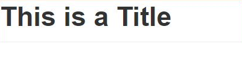
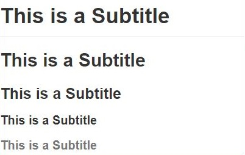
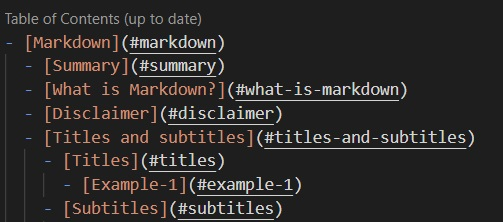
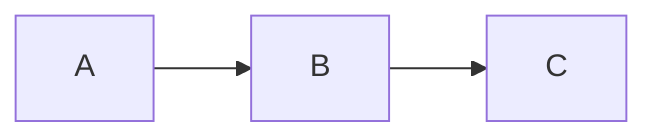

# Markdown

## Summary

- [Markdown](#markdown)
  - [Summary](#summary)
  - [What is Markdown?](#what-is-markdown)
  - [Disclaimer](#disclaimer)
  - [Titles and subtitles](#titles-and-subtitles)
    - [Titles](#titles)
    - [Subtitles](#subtitles)
  - [Text](#text)
    - [Regular paragraph](#regular-paragraph)
    - [Blockquote](#blockquote)
    - [Emphasizing](#emphasizing)
    - [Bold](#bold)
    - [Subscript](#subscript)
    - [Superscript](#superscript)
  - [Code](#code)
    - [Code inline](#code-inline)
    - [Code block](#code-block)
  - [Links](#links)
    - [External links](#external-links)
    - [Anchors](#anchors)
    - [Local File links](#local-file-links)
  - [Images](#images)
    - [Regular images](#regular-images)
    - [Gif](#gif)
  - [Lists](#lists)
    - [Ordered List](#ordered-list)
    - [Unordered List](#unordered-list)
  - [TODO List](#todo-list)
    - [Table of Contents](#table-of-contents)
  - [Foot notes](#foot-notes)
    - [Numbered footnotes](#numbered-footnotes)
    - [Big footnotes, multiple lines note](#big-footnotes-multiple-lines-note)
  - [Table](#table)
    - [Head](#head)
    - [Body](#body)
  - [Appendix](#appendix)
    - [Diagrams](#diagrams)
      - [Mermaid Diagrams](#mermaid-diagrams)
      - [Ditaa Diagrams](#ditaa-diagrams)
    - [What is a Slug?](#what-is-a-slug)
    - [Absolute and Relative paths](#absolute-and-relative-paths)
  - [Notes](#notes)

## What is Markdown?

Markdown[^1] is a text-to-HTML conversion tool for web writers. Markdown allows you to write using an easy-to-read, easy-to-write plain text format, then convert it to structurally valid XHTML (or HTML).

You can try it out, right now, using the online [Dingus](https://daringfireball.net/projects/markdown/dingus).

## Disclaimer

This a brief example I made to explain some syntax and some concepts from markdown and how someone could organize and navigate in their notes inside a project. 💗

## Titles and subtitles

A single `#` set a title and a sequence of `#` up to 6 set subtitles.

To set title and subtitles prepend `#` on the begin of a line you want to turn into a title or subtitle.

### Titles

```mono
# This is a Title
```

**Output:**



### Subtitles

```mono
## This is a Subtitle
### This is a Subtitle
#### This is a Subtitle
##### This is a Subtitle
###### This is a Subtitle
```

**Output:**



## Text

### Regular paragraph

It's just plain text written in your notes, like this one.

### Blockquote

Highlight a sentence by prepending `>` on beginning of a line you want to turn into a highlight block of content.

You can nest many blockquote you want by prepending more `>` together, each `>` adds a new blockquote level.

```mono
> This is a highlighted text in your notes
>> Many blockquote nested
```

**Output:**

> This is a highlighted text in your annotation
>> Many blockquote nested

### Emphasizing

To emphasize some bit of a paragraph add around the text to be emphasized single `*`.

```mono
Some of these words *are emphasized*.
```

**Output:**

Some of these words *are emphasized*.

### Bold

To turn a bit of a paragraph into bold add around the text to be bolded double `*` or double `_`

```mono
Words can't describe how **strong** LOVE can be.

Words can't describe how __strong__ LOVE can be.
```

**Output:**

Words can't describe how **strong** LOVE can be.

Words can't describe how **strong** LOVE can be.

### Subscript

```mono
H~2~O
```

**Output:**
H~2~O

### Superscript

```mono
X^2^
```

**Output:**
X^2^

## Code

### Code inline

To add snippets of code inside a paragraph, to make some kind of reference add around the code single \`

```mono
This paragraph contains a snippet of code `code_reference`
```

**Output:**

This paragraph contains a snippet of code `print("Hello Wold")`

### Code block

To add block of code to show in detail a code add triples \`.

~~~
```py(rb, js, cpp, md)
names = ["Lucas", "Someone"]

def greetings(name):
    print(f"Hello {name}")

greetings(names[1])
```
~~~

**Output:**

```py
names = ["Lucas", "Someone"]

def greetings(name):
    print(f"Hello {name}")

greetings(names[1])
```

## Links

### External links

To add external links use the syntax `[Link label](website_address)`

```mono
[QQ home page](https://im.qq.com/index)
```

**Output:**

[QQ home page](https://im.qq.com/index)

### Anchors

Anchors are used when you want to make a reference to the same file but throwing the reader for specific header(Title or Subtitle) of your note: `[Header Title](#header-title)`

Notice that you have to convert header title or subtitle into a slug[^2]  and you have to prepend a single `#`

```mono
[What is Markdown?](#what-is-markdown)
```

**Output:**

[What is Markdown?](#what-is-markdown)

### Local File links

To add links to local files use the syntax `[Link label](path_from_the_file)`

Notice that you need to do use a relative path[^3]

```mono
[Example](example-10/local_file.md)
```

**Output:**

[Example](example-10/local_file.md)

## Images

Images works almost exactly like links, the only difference is the syntax because you need to prepend `!`, like ``

### Regular images

```mono

```

**Output:**


### Gif

```mono

```

**Output:**


## Lists

### Ordered List

To create a list prepend a numeric order prefix `1.`.

```mono
1. Put oil on the pan
2. Break the eggs
3. Put eggs on the pan scramble it
```

**Output:**

1. Put oil on the pan
2. Break the eggs
3. Put eggs on the pan scramble it

### Unordered List

To create a list prepend `-`.

```mono
- Summary
  - Chapter 1
    - First topic
```

**Output:**

- Summary
  - Chapter 1
    - First topic

## TODO List

To create a todo list it's used the prefix `- [ ]`, to check this todo it's used `- [X]`

```mono
- [ ] First do this
- [ ] After do that
- [ ] After that do that too
```

**Output:**

- [ ] First do this
- [ ] After do that
- [ ] After that do that too

### Table of Contents

Table of content is basically an unordered list where each element of list references a link with a heading anchor, listing the documents itself by it's heading structure.



**Output:**


## Foot notes

In markdown we can also add footnotes, for that we use `[^1]` or `[^bignote]`

### Numbered footnotes

```mono
This text is an example [^4], and this text is another example [^5]

[^4]: An example is just a demonstration
[^5]: This is just another demonstration
```

**Output**:

This text is an example [^4], and this text is another example [^5]

[^4]: An example is just a demonstration
[^5]: This is just another demonstration

### Big footnotes, multiple lines note

**Output**:

This text is an example [^bignote]

[^bignote]: This is an example from a big note.
  Basically it means a multiline note

## Table

### Head

First line of table is the head, where you set up the column labels.

Second line is where you define the alignment of the content:

> `:-----` = set context alignment to left;
>
> `-----:` = set context alignment to right;
>
> `:----:` = set context alignment to center;

### Body

After second line any new line will be new row in the table

```mono
| Name      |  Age  | Height  |
| :-------- | :---: | :-----: |
| Lucas     |  35   | 1.76m   |
| Someone   |  35   | 1.61m   |
```

**Output:**

| Name      |  Age  | Height  |
| :-------- | :---: | :-----: |
| Lucas     |  35   | 1.76m   |
| Someone   |  35   | 1.61m   |

## Appendix

### Diagrams

Enhanced Markdown allow you to create diagrams, eventually it might require external dependencies, for instance `Mermaid` is built in Javascript, however `Ditaa` uses Java, so it requires you to install Java

#### Mermaid Diagrams

Mermaid allow you to draw my kinds of diagrams, but in my experience it seems more literal than visual, so for complex diagram is might get difficult to code

~~~mono
  ```mermaid
  graph LR
    A --> B
    B --> C
  ```
~~~

**Output:**



[Read more about Mermaid on `LearningMermaid` project](/specifics/LearningMermaid/README.md)

#### Ditaa Diagrams

Ditaa is something new for me but to me it seems more intuitive, it feels like you are really drawing  

~~~mono
  ```ditaa cmd=true

  +-----------------+       +--------+           +--------------------+
  | markdown source |------>| mdddia |------*--->| processed markdown |
  +-----------------+       +--------+      |    +--------------------+
                                |           \--->| image files        |
                      +------------------+       +--------------------+
                      | diagram creation |
                      +------------------+
                      | ditaa/dot/rdfdot |
                      +------------------+
  ```
~~~

**Output:**

```ditaa cmd=true
+-----------------+       +--------+           +--------------------+
| markdown source |------>| mdddia |------*--->| processed markdown |
+-----------------+       +--------+      |    +--------------------+
                              |           \--->| image files        |
                    +------------------+       +--------------------+
                    | diagram creation |
                    +------------------+
                    | ditaa/dot/rdfdot |
                    +------------------+
```

### What is a Slug?

What is a Slug? A slug is the last part of the url containing a unique string which identifies the resource being served by the web service. In that sense, a slug is a unique identifier for the resource.

### Absolute and Relative paths

An absolute, or full, path begins with a drive letter followed by a colon, such as `D:`.

A relative path refers to a location that is relative to a current directory. Relative paths make use of two special symbols, a dot (.) and a double-dot (..), which translate into the current directory and the parent directory. Double dots are used for moving up in the hierarchy. A single dot represents the current directory itself.

In the example directory structure below, assume you used Windows Explorer to navigate to `D:\Data\Shapefiles\Soils`. After navigating to this directory, a relative path will use `D:\Data\Shapefiles\Soils` as the current directory (until you navigate to a new directory, at which point the new directory becomes the current directory). The current directory is sometimes referred to as the root directory.

## Notes

[^1]:[Markdown Official Project](https://daringfireball.net/projects/markdown/)
[^2]:[What is a Slug?](#what-is-a-slug)
[^3]:[Absolute and Relative paths](#absolute-and-relative-paths)
