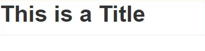

# Markdown

## Summary

- [Markdown](#markdown)
  - [Summary](#summary)
  - [What is Markdown?](#what-is-markdown)
  - [Disclaimer](#disclaimer)
  - [Titles and subtitles](#titles-and-subtitles)
    - [Titles](#titles)
      - [Example-1](#example-1)
    - [Subtitles](#subtitles)
      - [Example-2](#example-2)
  - [Text](#text)
    - [Regular paragraph](#regular-paragraph)
    - [Blockquote](#blockquote)
      - [Example-3](#example-3)
    - [Emphasizing](#emphasizing)
      - [Example-4](#example-4)
    - [Bold](#bold)
      - [Example-5](#example-5)
  - [Code](#code)
    - [Code inline](#code-inline)
      - [Example-6](#example-6)
    - [Code block](#code-block)
      - [Example-7](#example-7)
  - [Links](#links)
    - [External links](#external-links)
      - [Example-8](#example-8)
    - [Anchors](#anchors)
      - [Example-9](#example-9)
    - [Local File links](#local-file-links)
      - [Example-10](#example-10)
  - [Images](#images)
    - [Regular images](#regular-images)
      - [Example-11](#example-11)
    - [Gifs](#gifs)
      - [Example-12](#example-12)
  - [Lists](#lists)
    - [Ordered List](#ordered-list)
      - [Example-13](#example-13)
    - [Unordered List](#unordered-list)
      - [Example-14](#example-14)
    - [Table of Contents](#table-of-contents)
      - [Example-15](#example-15)
  - [Table](#table)
    - [Head](#head)
    - [Body](#body)
      - [Example-16](#example-16)
  - [Appendix](#appendix)
    - [What is a Slug?](#what-is-a-slug)
    - [Absolute and Relative paths](#absolute-and-relative-paths)
  - [Code Table](#code-table)
  - [References](#references)
    - [Markdown Official Project](#markdown-official-project)
    - [Slug](#slug)
    - [Paths](#paths)

## What is Markdown?

Markdown is a text-to-HTML conversion tool for web writers. Markdown allows you to write using an easy-to-read, easy-to-write plain text format, then convert it to structurally valid XHTML (or HTML).

You can try it out, right now, using the online [Dingus](https://daringfireball.net/projects/markdown/dingus).

*Reference:* [Markdown Official Project](#markdown-official-project)

## Disclaimer

This a brief example I made to explain some syntax and some concepts from markdown and how you could organize and navigate in your notes inside your own project. 💗

## Titles and subtitles

A single `#` set a title and a sequence of `#` up to 6 set subtitles.

To set title and subtitles prepend `#` on the begin of a line you want to turn into a title or subtitle.

### Titles

#### Example-1

```md
# This is a Title
```

Output



[Go to Code Table](#code-table)

### Subtitles

#### Example-2

```md
## This is a Subtitle
### This is a Subtitle
#### This is a Subtitle
##### This is a Subtitle
###### This is a Subtitle
```

Output


[Go to Code Table](#code-table)

## Text

### Regular paragraph

It's just plain text written in your notes, like this one.

### Blockquote

Highlight a sentence by prepending `>` on begining of a line you want to turn into a highlight block of content.

You can nest many blockquotes you want by prepending more `>` together, each `>` adds a new blockquote level.

#### Example-3

```md
> This is a highlighted text in your notes
>> Many blockquotes nested
```

Output

> This is a highlighted text in your annotation
>> Many blockquotes nested

[Go to Code Table](#code-table)

### Emphasizing

To emphasize some bit of a paragraph add around the text to be emphasized single `*` or single `_`.

#### Example-4

```md
Some of these words *are emphasized*.

Some of these words _are emphasized also_.
```

Output

Some of these words *are emphasized*.

Some of these words _are emphasized also_.

[Go to Code Table](#code-table)

### Bold

To turn a bit of a paragraph into bold add around the text to be bolded double `*` or double `_`

#### Example-5

```md
Words can't describe how **strong** LOVE can be.

Words can't describe how __strong__ LOVE can be.
```

Output

Words can't describe how **strong** LOVE can be.

Words can't describe how __strong__ LOVE can be.

[Go to Code Table](#code-table)

## Code

### Code inline

To add snippets of code inside a paragraph, to make some kind of reference add around the code single \`

#### Example-6

```md
This paragraph contains a snippet of code `code_reference`
```

Output

This paragraph contains a snippet of code `print("Hello Wold")`

[Go to Code Table](#code-table)

### Code block

To add block of code to show in detail a code add triples \`.

#### Example-7

```md
    ```py(rb, js, cpp, md)
    names = ["Lucas", "XiaoJiao"]

    def greetings(name):
        print(f"Hello {name}")

    greetings(names[1])
    ```
```

Output

```py
names = ["Lucas", "XiaoJiao"]

def greetings(name):
    print(f"Hello {name}")

greetings(names[1])
```

[Go to Code Table](#code-table)

## Links

### External links

To add external links use the syntax `[Link label](website_address)`

#### Example-8

```md
[QQ home page](https://im.qq.com/index)
```

Output

[QQ home page](https://im.qq.com/index)

[Go to Code Table](#code-table)

### Anchors

Anchors are used when you want to make a reference to the same file but throwing the reader for specific header(Title or Subtitle) of your note: `[Header Title](#header-title)`

Notice that you have to convert header title or subtitle into a slug [What is a Slug?](#what-is-a-slug) and you have to prepend a sigle `#`

#### Example-9

```md
[What is Markdown?](#what-is-markdown)
```

Output

[What is Markdown?](#what-is-markdown)

### Local File links

To add links to local files use the syntax `[Link label](path_from_the_file)`

Notice that you need to do use a relative path, read more about that in [Absolute and Relative paths](#absolute-and-relative-paths)

#### Example-10

```md
[Example](example-10/local_file.md)
```

Output

[Example](example-10/local_file.md)

## Images

Images works almost exactly like links, the only difference is the syntax because you need to prepend `!`, like ``

### Regular images

#### Example-11

```md

```

Output


### Gifs

#### Example-12

```md

```

Output


## Lists

### Ordered List

To create a list preprend a numeric order paramentes `1.`.

#### Example-13

```md
1. Put oil on the pan
2. Break the eggs
3. Put eggs on the pan scramble it
```

Output

1. Put oil on the pan
2. Break the eggs
3. Put eggs on the pan scramble it

### Unordered List

To create a list preprend `-`.

```md
- Summary
  - Chapter 1
    - First topic
```

Output

- Summary
  - Chapter 1
    - First topic

#### Example-14

```md
```

Output

### Table of Contents

Table of content is basically an unordened list where each element of list referecens a link with a heading anchor, listing the documento itself by it's heading strucure

#### Example-15


Output


## Table

### Head

First line of table is the head, where you set up the column labels.

Second line is where you define the alignment of the content:

> `:-----` = set context alignment to left;
>
> `-----:` = set context alignment to right;
>
> `:----:` = set context alignment to center;

### Body

After second line any new line will be new row in the table

#### Example-16

```md
| Name      |  Age  | Height  |
| :-------- | :---: | :-----: |
| Lucas     |  35   | 1.76m   |
| Xiao Jiao |  35   | 1.61m   |
```

Output

| Name      |  Age  | Height  |
| :-------- | :---: | :-----: |
| Lucas     |  35   | 1.76m   |
| Xiao Jiao |  35   | 1.61m   |

## Appendix

### What is a Slug?

What is a Slug? A slug is the last part of the url containing a unique string which identifies the resource being served by the web service. In that sense, a slug is a unique identifier for the resource.

*Reference:* [Slug](#slug)

### Absolute and Relative paths

An absolute, or full, path begins with a drive letter followed by a colon, such as D:.

A relative path refers to a location that is relative to a current directory. Relative paths make use of two special symbols, a dot (.) and a double-dot (..), which translate into the current directory and the parent directory. Double dots are used for moving up in the hierarchy. A single dot represents the current directory itself.

In the #### Example directory structure below, assume you used Windows Explorer to navigate to D:\Data\Shapefiles\Soils. After navigating to this directory, a relative path will use D:\Data\Shapefiles\Soils as the current directory (until you navigate to a new directory, at which point the new directory becomes the current directory). The current directory is sometimes referred to as the root directory.

*Reference:* [Paths explained](#paths)

## Code Table

| Syntax             |      Purpose      | Usage                          |             Example              |
| :----------------- | :---------------: | :----------------------------- | :------------------------------: |
| #                  |      Titles       | `#` My Title                   |       [Titles](#example-1)       |
| ##                 |     Subtitles     | `##` My Subitle                |     [Subtitles](#example-2)      |
| ###                |     Subtitles     | `###` My Subitle               |     [Subtitles](#example-2)      |
| ####               |     Subtitles     | `####` My Subitle              |     [Subtitles](#example-2)      |
| #####              |     Subtitles     | `#####` My Subitle             |     [Subtitles](#example-2)      |
| ######             |     Subtitles     | `######` My Subitle            |     [Subtitles](#example-2)      |
| >                  |     Highlight     | `>` Important sentence         |     [Blockquote](#example-3)     |
| *                  |     Emphasize     | My `*`important`*` text        |     [Emphasize](#example-4)      |
| -                  |     Emphasize     | My `_`important`_` text        |     [Emphasize](#example-4)      |
| **                 |       Bold        | My `**`strong`**` word         |        [Bold](#example-5)        |
| __                 |       Bold        | My `__`strong`__` word         |        [Bold](#example-5)        |
| \`                 |   Display code    | using \``print("Hello")`\`     |    [Code inline](#example-6)     |
| \`\`\`             |   Display code    |  |     [Code Block](#example-7)     |
| \[label\]\(url\)   |       Links       | \[home\]\(example.com\)        |         [links](#links)          |
| \!\[name\]\(path\) |      Images       | \[Thumb\]\(thumb.jpg\)         |        [Images](#images)         |
| `n`.               |       List        | `1.` Open the box              |   [Ordered List](#example-13)    |
| -                  |       List        | `-` Random List                |   [Unrdered List](#example-14)   |
| - \[label\]\(url\) | Table of contents | `- [summary](#summary)`        | [Table of contents](#example-15) |
|                    |      Table        |                                |       [Tables](#example-16)      |

## References

### Markdown Official Project

[daringfireball.net](https://daringfireball.net/projects/markdown/)

### Slug

[Web Developer Playbook: Slug](https://medium.com/dailyjs/web-developer-playbook-slug-a6dcbe06c284)

### Paths

[Paths explained: Absolute, relative, UNC, and URL](https://desktop.arcgis.com/en/arcmap/10.3/tools/supplement/pathnames-explained-absolute-relative-unc-and-url.htm#GUID-5118AC85-57E4-4027-AC24-FB6E99FADEFF)
